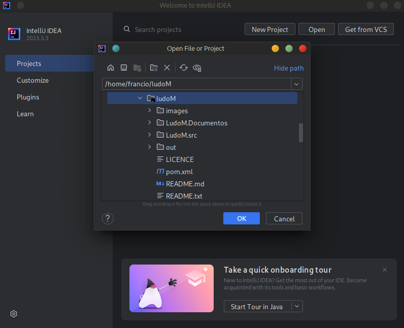
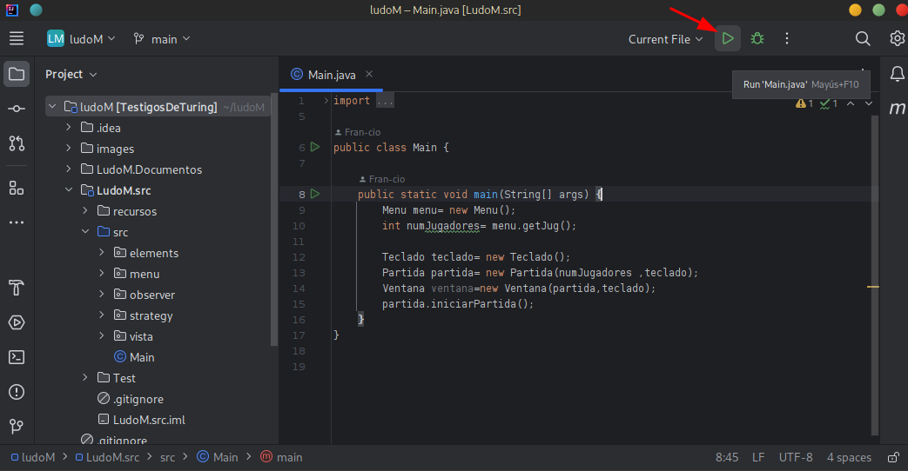

<!-- Improved compatibility of back to top link: See: https://github.com/othneildrew/Best-README-Template/pull/73 -->
<a name="readme-top"></a>
<!--
*** Thanks for checking out the Best-README-Template. If you have a suggestion
*** that would make this better, please fork the repo and create a pull request
*** or simply open an issue with the tag "enhancement".
*** Don't forget to give the project a star!
*** Thanks again! Now go create something AMAZING! :D
-->


<!-- PROJECT SHIELDS -->
<!--
*** I'm using markdown "reference style" links for readability.
*** Reference links are enclosed in brackets [ ] instead of parentheses ( ).
*** See the bottom of this document for the declaration of the reference variables
*** for contributors-url, forks-url, etc. This is an optional, concise syntax you may use.
*** https://www.markdownguide.org/basic-syntax/#reference-style-links
-->
[![Contributors][contributors-shield]][contributors-url]
[![Forks][forks-shield]][forks-url]
[![Stargazers][stars-shield]][stars-url]
[![Issues][issues-shield]][issues-url]
[![MIT License][license-shield]][license-url]
[![LinkedIn][linkedin-shield]][linkedin-url]


<!-- PROJECT LOGO -->
<br />
<div align="center">
  <a href="https://github.com/Fran-cio/ludoM">
    
  </a>

<h3 align="center">LudoM</h3>

  <p align="center">
    An implementation of a local multiplayer Parcheesi game for 2 to 4 players.
    <br />
    <a href="https://github.com/Fran-cio/ludoM"><strong>Explore the docs »</strong></a>
    <br />
    <br />
    <a href="https://github.com/Fran-cio/ludoM/ludoM">View Demo</a>
    ·
    <a href="https://github.com/Fran-cio/ludoM/issues">Report Bug</a>
    ·
    <a href="https://github.com/Fran-cio/ludoM/issues">Request Feature</a>
  </p>
</div>


<!-- TABLE OF CONTENTS -->
<details>
  <summary>Table of Contents</summary>
  <ol>
    <li>
      <a href="#about-the-project">About The Project</a>
      <ul>
        <li><a href="#built-with">Built With</a></li>
      </ul>
    </li>
    <li>
      <a href="#getting-started">Getting Started</a>
      <ul>
        <li><a href="#installation">Installation</a></li>
      </ul>
    </li>
    <li><a href="#usage">Usage</a></li>
    <li><a href="#contributing">Contributing</a></li>
    <li><a href="#license">License</a></li>
    <li><a href="#contact">Contact</a></li>
    <li><a href="#acknowledgments">Acknowledgments</a></li>
  </ol>
</details>


<!-- ABOUT THE PROJECT -->
## About The Project

![Product Name Screen Shot][product-screenshot]
<br>
An excellent proposal for practicing object-oriented programming and the Model-View-Controller, State Machine, and Observer design patterns is with a playful idea. From here arises LudoM, a Java implementation of the famous Parcheesi game for 2 to 4 players.

This development was done within an academic framework where agile methodologies were put into practice, and relevant documentation was produced. The associated documents can be reviewed in the folder [`LudoM.Documentos`](LudoM.Documentos).
<p align="right">(<a href="#readme-top">back to top</a>)</p>


### Built With

* 
* 

<p align="right">(<a href="#readme-top">back to top</a>)</p>


<!-- GETTING STARTED -->
## Getting Started
### Prerequisites
Access the installation instructions for the following dependencies.
* [IntelliJ](https://www.jetbrains.com/idea/) 
* [Java 17](https://www.java.com/es/download/java8_update.jsp) 
### Installation

1. Clone the repo
   ```sh
   git clone https://github.com/Fran-cio/ludoM.git
   ```
2. Open the project 
    
3. Run Main

    

    Most likely, at this step, the appropriate JDK will be installed if you haven't installed it previously.

<!-- USAGE EXAMPLES -->
## Usage
Once the program is started, the following subtle graphical interface is displayed, allowing you to select the number of players.

<div align=center>
    
</div>
Once the number of players is selected, the game automatically begins with the player 1 rolling the dice until a 6 is rolled. From there, the conventional [rules](https://www.mastersofgames.com/rules/parchis-rules-instructions-guide.html) of Parcheesi are followed.

The game information is displayed on the right side of the screen, where it specifies the pieces in play, the piece number, its status on the board, and its position in coordinates.

The player makes their move by pressing the numbers from 1 to 4, indicating the piece with which they want to make the move. 

<p align="right">(<a href="#readme-top">back to top</a>)</p>


<!-- CONTRIBUTING -->
## Contributing

Contributions are what make the open source community such an amazing place to learn, inspire, and create. Any contributions you make are **greatly appreciated**.

If you have a suggestion that would make this better, please fork the repo and create a pull request. You can also simply open an issue with the tag "enhancement".
Don't forget to give the project a star! Thanks again!

1. Fork the Project
2. Create your Feature Branch (`git checkout -b feature/AmazingFeature`)
3. Commit your Changes (`git commit -m 'Add some AmazingFeature'`)
4. Push to the Branch (`git push origin feature/AmazingFeature`)
5. Open a Pull Request

<p align="right">(<a href="#readme-top">back to top</a>)</p>


<!-- LICENSE -->
## License

Distributed under the Beerware License🍻. See `LICENSE.txt` for more information.

<p align="right">(<a href="#readme-top">back to top</a>)</p>


<!-- CONTACT -->
## Contact

Francisco Ciordia Cantarella - francisco.ciordia.cantarella@gmail.com

Project Link: [https://github.com/Fran-Cio/ludoM](https://github.com/Fran-Cio/ludoM)

<p align="right">(<a href="#readme-top">back to top</a>)</p>


<!-- ACKNOWLEDGMENTS -->
## Acknowledgments
* [Parcheesi what?](https://en.wikipedia.org/wiki/Parch%C3%ADs)
* [MVC (Model, View, Controller)](https://codigofacilito.com/articulos/mvc-model-view-controller-explicado)
* [Observer Desing Pattern](https://refactoring.guru/design-patterns/observer)
* [State Desing Pattern](https://refactoring.guru/es/design-patterns/state)
* [Pretty Badges](https://github.com/Ileriayo/markdown-badges)
* [Logo Generator](https://www.bing.com/images/create?FORM=BICMB1&ssp=1&darkschemeovr=0&setlang=es-CL&safesearch=moderate&toWww=1&redig=8195C3604CE2443CAD2B9B2FB3512087)
* [Template of this readme](https://github.com/othneildrew/Best-README-Template?tab=readme-ov-file)

<p align="right">(<a href="#readme-top">back to top</a>)</p>


<!-- MARKDOWN LINKS & IMAGES -->
<!-- https://www.markdownguide.org/basic-syntax/#reference-style-links -->
[contributors-shield]: https://img.shields.io/github/contributors/Fran-Cio/ludoM.svg?style=for-the-badge
[contributors-url]: https://github.com/Fran-cio/ludoM/graphs/contributors
[forks-shield]: https://img.shields.io/github/forks/Fran-cio/ludoM.svg?style=for-the-badge
[forks-url]: https://github.com/Fran-Cio/ludoM/network/members
[stars-shield]: https://img.shields.io/github/stars/Fran-Cio/ludoM.svg?style=for-the-badge
[stars-url]: https://github.com/Fran-Cio/ludoM/stargazers
[issues-shield]: https://img.shields.io/github/issues/Fran-Cio/ludoM.svg?style=for-the-badge
[issues-url]: https://github.com/Fran-Cio/ludoM/issues
[license-shield]: https://img.shields.io/badge/license-Beerware%F0%9F%8D%BB-green?style=for-the-badge
[license-url]: https://github.com/Fran-Cio/ludoM/blob/master/LICENSE.txt
[linkedin-shield]: https://img.shields.io/badge/-LinkedIn-black.svg?style=for-the-badge&logo=linkedin&colorB=555
[linkedin-url]: https://www.linkedin.com/in/francisco-ciordia-cantarella-5323461b8/
[product-screenshot]: images/screenshot.png
[usage-example]: images/example.png

[C]:https://img.shields.io/badge/c-%2300599C.svg?style=for-the-badge&logo=c&logoColor=white
[CMake]:https://img.shields.io/badge/CMake-%23008FBA.svg?style=for-the-badge&logo=cmake&logoColor=white
[Cmake-url]:https://cmake.org/
[Neovim]:https://img.shields.io/badge/NeoVim-%2357A143.svg?&style=for-the-badge&logo=neovim&logoColor=white
[Neovim-url]:https://neovim.io/

[Linux]:https://img.shields.io/badge/Linux-FCC624?style=for-the-badge&logo=linux&logoColor=black
